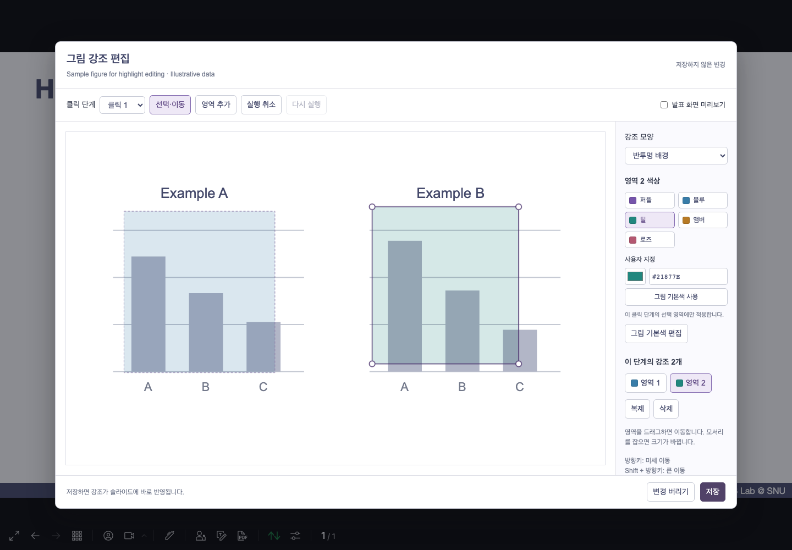

# Slidev Authoring

Markdown citations and a visual figure-highlight editor for Slidev. Annotations and bibliography data are stored in the deck.

**Requirements:** Node.js 22.12+ and Slidev 52.19.1. Tested with Vue 3.5 and Vite 8.2.2.

[Setup](#setup) · [Editing](#edit-highlights) · [Configuration](#configuration)

## Setup

### 1. Install the addon

```sh
npm install -D github:seonjunn/slidev-authoring
```

Commit `package-lock.json` to pin the installed revision.

### 2. Enable it in the deck

Add the addon to the first frontmatter block in `slides.md`:

```yaml
addons:
  - slidev-addon-authoring
```

Create `vite.config.ts` beside `slides.md`:

```ts
import { fileURLToPath } from 'node:url'
import { authoring } from 'slidev-addon-authoring/vite'

export default authoring({
  root: fileURLToPath(new URL('.', import.meta.url)),
})
```

### 3. Add the deck data

| File | Contents |
| --- | --- |
| `public/figures/` | Images displayed in slides |
| `annotations.json` | Start with `{}`; the editor writes highlights here |
| `references.json` | Bibliography entries keyed by citation number |

Example `references.json`:

```json
{
  "1": {
    "authors": "Author et al.",
    "title": "Paper title",
    "venue": "Conference 2026"
  }
}
```

### 4. Write Markdown

```md
---
contentId: example
clicks: 1
---

# A concise claim

- Supporting evidence belongs beside its citation. [1]


```

`[1]` becomes a superscript citation and a bibliography footer. An image under `/figures/` becomes an editable figure. Use a layout with a figure area, or set a height for `.authoring-visual` in the deck's CSS.

## Edit highlights

1. Start the deck's Slidev dev server and open a slide containing a figure.
2. Hover over the figure and select **그림 강조 편집**.
3. Choose the click step, then select an existing region or add one.
4. Drag to move a region; use its corner handles to resize it.
5. Choose a preset or a custom color for the selected region. Select **그림 기본색 편집** to change the default across click steps.
6. Preview the result and select **저장** to save.



*The screenshot uses a sample image. The editor's current interface is Korean.*

| Control | Action |
| --- | --- |
| **클릭 단계** | Select a click step |
| **영역 추가** | Draw a new region |
| **실행 취소** / **다시 실행** | Undo / redo |
| **발표 화면 미리보기** | Preview without editing handles |
| **강조 모양** | Choose a translucent fill or an outline |
| **영역 색상** / **그림 기본색** | Use purple, blue, teal, amber, rose, or a custom color |
| **사용자 지정** | Use the color picker or enter a six-digit `#RRGGBB` value |
| **그림 기본색 사용** / **테마 색상 사용** | Remove a region override / restore the theme default |
| **저장** / **변경 버리기** | Save / discard changes |
| Arrow keys / Shift + arrow keys | Move a region in small / larger increments |

Saving updates `annotations.json`. A stable `contentId` keeps highlights attached to a slide when it is reordered. Concurrent edits to the same figure are checked before saving.

Colors can distinguish different roles within the same figure. A region color affects only that region in that click step. A figure default affects all regions without an override, across all steps. Changing colors supports undo/redo and keeps coordinates unchanged. Existing annotations inherit the theme color.

### Annotation colors

The original `[x, y, width, height]` regions remain valid. A fifth value overrides a region's color; optional `focusColor` sets the figure default. Colors are six-digit hex values. Both fills and outlines use them.

```json
{
  "example": {
    "src": "/figures/example.png",
    "ratio": 2,
    "focusStyle": "wash",
    "focusColor": "#7655AB",
    "regions": [[], [[10, 20, 30, 40, "#21877E"], [55, 20, 30, 40]]]
  }
}
```

### Editing scope

- One editable figure per `contentId`, with up to 40 click states.
- Set `clicks` in Markdown before editing highlight steps. Each step stores its own regions.
- Check alignment after changing a figure's crop or dimensions.
- Mermaid structure is edited in its source file.

The local dev server provides the editor and save endpoint. Static builds contain the figures, highlights, and citations. Slidev provides the **Slide** and **Notes** editors separately.

## Configuration

### Deck files

Paths are relative to `root` and must stay inside it.

| Option | Default | Purpose |
| --- | --- | --- |
| `root` | Required | Absolute deck directory |
| `entry` | `slides.md` | Slide source |
| `annotations` | `annotations.json` | Highlight data |
| `references` | `references.json` | Bibliography |

### Markdown extensions

| Option | Purpose |
| --- | --- |
| `renderImage({ src, caption, escape })` | Return custom markup for a deck-specific image, or `undefined` to use the editable figure. |
| `markdownSetup(md)` | Add deck-specific Markdown rules after the addon. |

### Appearance

Set CSS variables in the deck to match its theme:

```css
:root {
  --authoring-highlight: #7655ab;
  --authoring-reference-inset: 40px;
  --authoring-reference-bottom: 20px;
  --authoring-reference-size: 11px;
  --authoring-caption-size: 15px;
}
```

`.authoring-visual` fills its parent by default. The theme defines the surrounding slide layout.

## Development

```sh
npm ci
npm test
npm pack
```

The package ships Vue source directly. Usage screenshots in `guide/` belong to the repository documentation and are excluded from the npm package.
